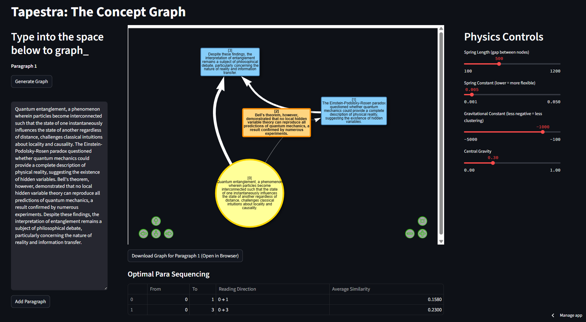

# Tapestra: The Concept Graph

An interactive Streamlit web app for visualizing and analyzing conceptual relationships within and across paragraphs of text. Tapestra uses NLP, graph theory, and physics-based visualization to help users explore the structure and flow of ideas in their writing.

---

## 🚀 Live App

**Try the live app [here](https://tapestra-jzh6yjyhlhcs5r8xtxwjtz.streamlit.app/)!**  


---

## 📸 Screenshots

<p align="center">  </p> 
<p align="center">  </p>


---

## 📝 Features

- **Paragraph-by-Paragraph Concept Graphs:**  
  - Enter or edit paragraphs and generate directed concept graphs based on sentence similarity and importance.
  - Interactive physics controls (spring length, spring constant, gravity, central gravity) for each paragraph’s graph.

- **Combined Concept Graph:**  
  - Combine all key nodes from all paragraphs into a single graph.
  - Separate physics controls for the combined graph.
  - Download any graph as an HTML file.

- **Optimal Reading Path:**  
  - Table showing optimal reading sequences based on graph structure.

- **Modern UI:**  
  - Responsive, wide layout with custom CSS.
  - All controls and graphs are always visible and interactive.

- **Dark Theme:**  
  - Clean, dark-themed interface for readability and focus.

---

## 🖥️ Running Locally

### **Requirements**
- Python 3.8 or higher
- See `requirements.txt` for dependencies

### **Install Dependencies**
```bash
pip install -r requirements.txt
```

### **Run the App**
```bash
streamlit run app.py
```

---

## 🛠️ Usage Guide

### **1. Enter or Edit Paragraphs**
- In the left column, type or paste your paragraph.
- Click **"Generate Graph"** to visualize the concept graph for that paragraph.
- A node wise Reading Direction will be generated to ease reading.
- Node numbers are displayed in he start of node labels in the graph

### **2. Adjust Physics Controls**
- Use the sliders in the rightmost column to adjust the appearance and layout of the graph:
  - **Spring Length:** Controls the gap between nodes.
  - **Spring Constant:** Adjusts flexibility.
  - **Gravitational Constant:** Controls clustering.
  - **Central Gravity:** Pulls nodes toward the center.

### **3. Add More Paragraphs**
- Click **"Add Paragraph"** to insert another text box and repeat the process.

### **4. Combine Information**
- Click **"Article Covered: Combine Information"** upon entering all paragraph to generate a combined concept graph of all key sentences of the passage.
- Use the left column to adjust physics controls for the combined graph.
- An Article Walkthough in directed graph fashion will be displayed
- Download the combined graph as HTML.

### **5. Explore and Download**
- Interact with the graphs directly in the app.
- Download any graph for offline viewing or sharing.

---

## 💡 Example Use Cases

- Visualizing logical flow in essays, articles, or research papers
- Exploring conceptual connections in academic writing
- Teaching or learning about graph-based text analysis
- Optimizing the structure of technical or scientific documents

---

## 🧑‍💻 Development & Contribution

### **Contributing**
Contributions are welcome!  
- Fork this repo and submit a pull request.
- Please open an issue for bugs, suggestions, or feature requests.

### **Coding Style**
- Follows PEP8 and Streamlit best practices.
- Modular, readable code for easy extension.

### **Testing**
- Test locally with a variety of text inputs and paragraph counts.
- Check graph interactivity and download features.

---

## 📣 Feedback & Support

- Found a bug or want to suggest a feature?  
  [Open an issue](https://github.com/Aadityaamlan-Panda/Tapestra/issues) or submit a pull request!
- For questions or functioning related queries, mail me: [Aadityaamlan Panda](aadityaap22@iitk.ac.in)

---

## 🤝 Credits

- Built with [Streamlit](https://streamlit.io/)
- NLP by [NLTK](https://www.nltk.org/), [scikit-learn](https://scikit-learn.org/)
- Graphs by [NetworkX](https://networkx.org/) and [PyVis](https://pyvis.readthedocs.io/)

---

## 📄 License

This project is licensed under the MIT License. See [LICENSE](LICENSE) for details.

---

## 🔗 References

- [Streamlit Docs: Creating and Sharing Apps](https://docs.streamlit.io/)
- [Streamlit Deployment Guide](https://docs.streamlit.io/deploy/tutorials)
- [Awesome Streamlit Project Templates](https://streamlit.io/gallery)
- [GeeksforGeeks: NLTK Tutorial](https://www.geeksforgeeks.org/python/introduction-to-nltk-tokenization-stemming-lemmatization-pos-tagging/)

---

**Enjoy exploring your ideas visually!**
